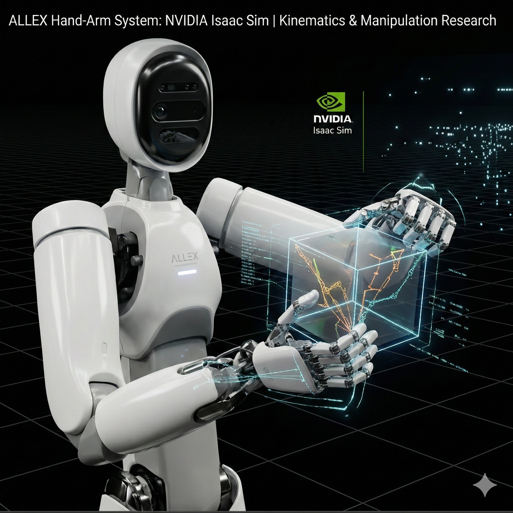

<div align="center">

# 🔬 IRIM_LAB

**NVIDIA Isaac Sim 기반 ALLEX 디지털 트윈 및 Sim2Real 디버깅 환경**

[](https://developer.nvidia.com/isaac-sim)
[](https://www.python.org/)
[](https://www.ros.org/)

<p align="center">
  
</p>

[Overview](#-overview) •
[Features](#-features) •
[Installation](#-installation) •
[Usage](#-usage) •
[Modules](#-modules) •
[Project Structure](#-project-structure)

</div>

---

## 📖 Overview

**IRIM_LAB**는 NVIDIA Isaac Sim 환경에서 ALLEX 로봇의 **디지털 트윈(Sim2Sim)** 과 **Sim2Real 디버깅·센서 실험**을 위한 확장 프로그램입니다.

시뮬레이션 시나리오 제어, ROS2 연동, 학습된 정책·궤적 기반 인퍼런스 및 관측 대시보드를 한 확장에서 제공합니다.

### 주요 특징

- 🎮 **Sim2Sim** — LOAD/RESET/RUN 시나리오, 관절 슬라이더·ROS2 제어, 관절 그룹·오버레이
- 🤖 **Sim2Real Debugger** — 정책(.pt/.pth)·궤적(.npz) 드롭 로드, 인퍼런스 실행, ROS2 관측/액션 퍼블리시, PyQtGraph 관측 플롯
- 🔧 **Sensor Lab** — 센서 테스트 에셋·카메라·Rigid Body, 토크 테스트 UI
- 📡 **ROS2** — Pub/Sub 독립 제어, Domain ID 설정, 실기 연동(선택)

---

## ✨ Features

### 🎮 Sim2Sim (ALLEX Digital Twin)

| 기능 | 설명 |
|------|------|
| **World Controls** | LOAD / RESET / RUN 시나리오 제어 |
| **Joint Controls** | 슬라이더 기반 관절 제어, 관절 그룹 표시 on/off |
| **ROS2 Manager** | Publisher/Subscriber 독립 토글, 관절·토크·정책 액션 송수신 |
| **오버레이** | Force/Torque·관절·손 관절 텍스트 시각화 |

### 🤖 Sim2Real Debugger (sim2sim_console)

| 기능 | 설명 |
|------|------|
| **Drag & Drop** | 정책(.pt/.pth)·궤적(.npz) 파일 드롭으로 로드 |
| **Inference** | reference + residual·scale, playback_speed(PPO), 초기 자세 리셋 |
| **ROS2 I/O** | 관측 구독·정책 액션/last_actions 퍼블리시, Domain ID 77 실기 joint_command 분할 |
| **Observation Debug** | 관측 차원·스트리밍 상태·Hz 표시, 관측별 플롯(PyQtGraph) |

### 🔧 Sensor Lab

| 기능 | 설명 |
|------|------|
| **에셋·카메라** | 센서 테스트 에셋 로드, 카메라·Rigid Body(구 등) 생성 |
| **토크 테스트** | 전용 UI로 토크 센서 동작 확인 |

---

## 🚀 Installation

### 사전 요구사항

- NVIDIA Isaac Sim **5.1.0** 이상
- Python **3.10** 이상
- ROS2 (rclpy) — **Sim2Real Debugger 실기 연동 시에만 필요**

### 설치 방법

```bash
# 1. Isaac Sim의 extsUser 폴더로 이동
cd {ISAAC_SIM_PATH}/extsUser/

# 2. 리포지토리 클론 (또는 IRIM_LAB 폴더 배치)
git clone <repository_url> IRIM_LAB

# 3. Isaac Sim 재시작
```

---

## 📖 Usage

### 기본 사용법

1. **Extensions 활성화**
   - `Window` → `Extensions` 열기
   - "irim_lab" 또는 "IRIM_LAB" 검색 후 활성화

2. **Sim2Sim 창**
   - 툴바에서 **Sim2Sim** 메뉴/아이콘 클릭
   - **LOAD** → 로봇 에셋 로드
   - **ROS2 Manager** 초기화 후 Publisher/Subscriber 토글로 제어 모드 선택
   - **RUN** → 시나리오 실행, 관절 제어·오버레이 확인

3. **Sim2Real Debugger**
   - sim2sim_console에서 Debugger 창 실행
   - **Drag & Drop** 영역에 정책(.pt/.pth)·궤적(.npz) 파일 드롭
   - **Connect** (ROS2 Domain ID 설정) → **Start Inference**
   - Observation Debug에서 차원·플롯 확인

4. **Sensor Lab**
   - **Sensor Lab** 메뉴로 전용 창 열기
   - World Controls로 에셋 로드, 토크 테스트 UI 사용

### 예제: Sim2Real 디버깅 흐름

```
1. [Sim2Sim] 창에서 LOAD 후 RUN (필요 시)
2. [Sim2Real Debugger] 창 열기
3. 정책 파일(.pt) · 궤적 파일(.npz) 드롭
4. ROS2 Connect (실기 연동 시 Domain ID 77 등 설정)
5. Scale/Speed/Duration 설정 후 [Start Inference]
6. Observation Debug에서 관측 상태·플롯 확인
```

---

## 📦 Modules

```
┌─────────────────────────────────────────────────────────────────┐
│                         IRIM_LAB                                 │
├─────────────────────────────────────────────────────────────────┤
│  ┌─────────────────┐  ┌─────────────────┐  ┌───────────────────┐ │
│  │    Sim2Sim      │  │ Sim2Real        │  │    Sensor Lab     │ │
│  │ (Digital Twin)  │  │ Debugger        │  │                   │ │
│  │                 │  │(sim2sim_console)│  │  에셋·토크 테스트   │ │
│  │ LOAD/RUN/ROS2   │  │ Policy·Traj·ROS2│  │                   │ │
│  └─────────────────┘  └─────────────────┘  └───────────────────┘ │
├─────────────────────────────────────────────────────────────────┤
│  ROS2: Pub/Sub 독립 제어 · Domain ID · 관절·토크·액션 송수신      │
├─────────────────────────────────────────────────────────────────┤
│  DDVC: 100_PRD · 101_Refactoring · 102_Commit_Push               │
└─────────────────────────────────────────────────────────────────┘
```

---

## 📁 Project Structure

```
IRIM_LAB/
├── 📄 README.md                    # 프로젝트 문서
├── 📁 asset/                       # USD 에셋
│   └── ALLEX/                      # ALLEX 로봇·센서 테스트용
├── 📁 config/
│   └── extension.toml              # 확장 메타데이터
├── 📁 data/
│   ├── icon.png
│   └── preview.png
├── 📁 irim_lab_python/             # Python 소스코드
│   ├── extension.py                # 확장 진입점, 메뉴·창 등록
│   ├── global_variables.py         # 제목·상수
│   ├── 📁 sim2sim_test/            # Sim2Sim
│   │   ├── ui_builder.py            # 메인 UI
│   │   ├── scenario.py              # ALLEX Digital Twin 시나리오
│   │   ├── asset_manager.py
│   │   ├── config.py
│   │   ├── 📁 ros2/                 # ROS2 Manager·Node
│   │   └── 📁 sim2sim_console/      # Sim2Real Debugger
│   │       ├── sim2real_debugger_gui.py
│   │       └── 📁 sim2real_debugger/
│   │           ├── dashboard.py    # PyQtGraph 대시보드
│   │           ├── inference.py    # 인퍼런스·TrajectoryLoader
│   │           ├── policy.py       # 정책 로드·forward
│   │           ├── ros2_io.py       # ROS2 구독/퍼블리시
│   │           ├── config.py · observation.py · widgets.py
│   │           └── policy/          # .pt 샘플 (선택)
│   ├── 📁 sensor_test/              # Sensor Lab
│   │   ├── sensor_lab_ui_builder.py
│   │   ├── sensor_lab_asset.py
│   │   └── sensor_lab_*.py
│   └── 📁 DDVC/                    # 설계·규칙 문서
│       ├── 100_PRD.md              # 제품 요구사항
│       ├── 101_Refactoring.md      # 리팩터링 지침
│       └── 102_Commit_Push.md      # 커밋·푸시 규칙
└── 📁 docs/
    └── CHANGELOG.md
```

---

## 🔧 Architecture

확장은 **메뉴·창별 UI Builder**와 **Scenario**로 구성됩니다:

```
┌──────────────────┐     ┌──────────────────┐
│  extension.py    │────▶│  UIBuilder /     │
│  메뉴·창 등록     │     │  SensorLabUIBuilder│
└──────────────────┘     └────────┬─────────┘
                                  │
                    ┌─────────────┼─────────────┐
                    ▼             ▼             ▼
             ┌──────────┐  ┌──────────┐  ┌──────────────┐
             │ scenario │  │ ros2/    │  │ sim2sim_     │
             │ (Sim2Sim)│  │ manager  │  │ console      │
             └──────────┘  └──────────┘  │ (Debugger)   │
                                          └──────────────┘
```

- **Sim2Sim**: `ui_builder.py` → `scenario.py`, `ros2/` — LOAD/RUN, 관절·ROS2 제어
- **Sim2Real Debugger**: PyQtGraph 대시보드 → inference·policy·ros2_io
- **Sensor Lab**: 전용 UI Builder → 센서 에셋·토크 테스트

---

## 📚 References

- [IRIM_LAB DDVC — 100_PRD](irim_lab_python/DDVC/100_PRD.md) — 목적·기능·산출물
- [IRIM_LAB DDVC — 101_Refactoring](irim_lab_python/DDVC/101_Refactoring.md) — 리팩터링·코드 품질 지침
- [NVIDIA Isaac Sim Documentation](https://docs.omniverse.nvidia.com/isaacsim/latest/)

---

<div align="center">

**ALLEX Digital Twin & Sim2Real Debugging on Isaac Sim**

</div>
